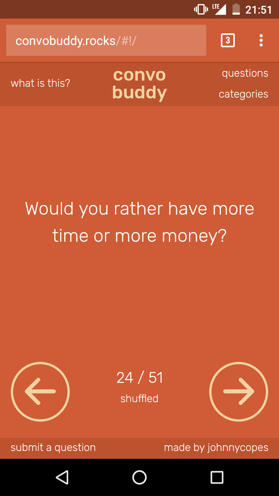

# Convo Buddy

######
[Live Project]()   |   [Overview](https://github.com/johnnycopes/convo-buddy/#overview)   |   [What I Used](https://github.com/johnnycopes/convo-buddy#what-i-used)   |   [MVP](https://github.com/johnnycopes/convo-buddy#mvp-minimum-viable-product)   |   [Challenges](https://github.com/johnnycopes/convo-buddy#challenges--solutions)   |   [Code](https://github.com/johnnycopes/convo-buddy#code-snippets)   | [Screenshots](https://github.com/johnnycopes/convo-buddy#screenshots)   |

## Overview:


##What we used:
**Languages:**  
* HTML5
* CSS
* JavaScript (Node.js)

**Frameworks:**  
* Angular
* Express

**Other:**  
* MongoDB
* Amazon Web Services EC2
* Apache
* Icon from The Noun Project
  * *SPEECH BUBBLES made by bmijnlieff -- info@bmijnlieff.nl*
  * *CHECKMARK made by Sergey Shmidt -- http://shmidt.co/*


## MVP (Minimum Viable Product):
A clean, fast, and easy-to-use tool that works well across devices and browsers. Pre-loaded with a curated selection of conversation questions that can be generated individually or viewed all at once.

**Initial MVP**
*
*
*
*

**Stretch Goals**
*
*
*
*

## Challenges & Solutions:
Below are some of the most notable challenges I came across while making this project:

1.  **Challenge:**

    **Solution:**

2.  **Challenge:**

    **Solution:**

3.  **Challenge:**

    **Solution:**

4. **Challenge:**

    **Solution:**


## Code Snippets

(description):
```JavaScript
```

(description):
```JavaScript
```

(description):
``` JavaScript
```

## Screenshots




********
