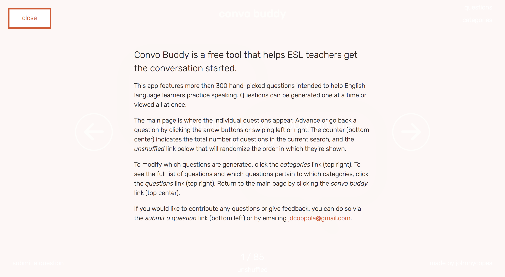
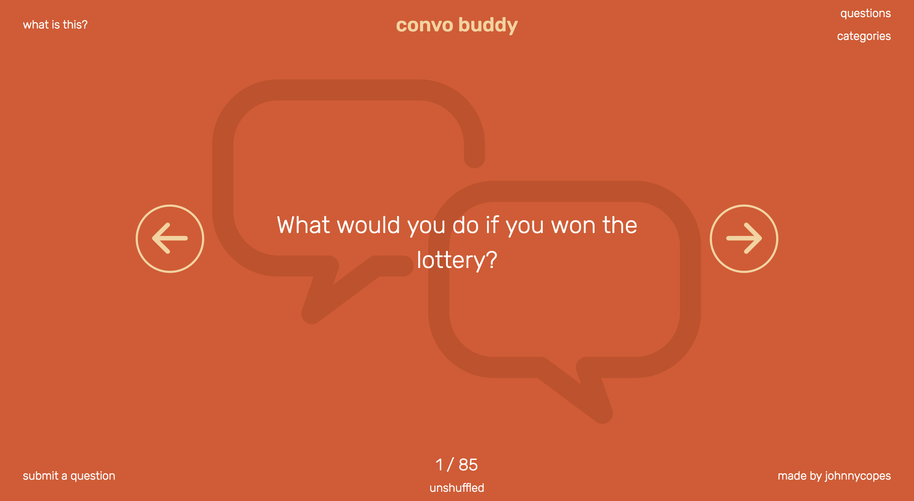
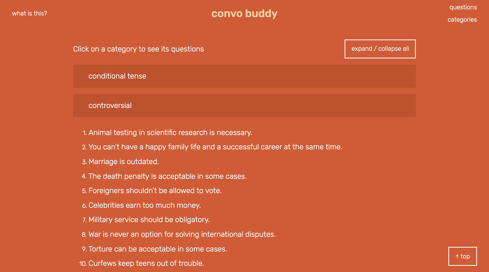

# Convo Buddy

######
[Live Project]()   |   [Overview](https://github.com/johnnycopes/convo-buddy/#overview)   |   [What I Used](https://github.com/johnnycopes/convo-buddy#what-i-used)   |   [MVP](https://github.com/johnnycopes/convo-buddy#mvp-minimum-viable-product)   |   [Challenges](https://github.com/johnnycopes/convo-buddy#challenges--solutions)   |   [Code](https://github.com/johnnycopes/convo-buddy#code-snippets)   | [Screenshots](https://github.com/johnnycopes/convo-buddy#screenshots)   | [Contribute](https://github.com/johnnycopes/convo-buddy#contribute-to-convo-buddy)

## Overview:
Convo Buddy is a free tool that helps ESL teachers get the conversation started. Features more than 300 hand-picked questions intended to help English language learners practice speaking. Questions can be generated one at a time or viewed all at once.

##What we used:
**Languages:**  
* HTML5
* CSS/SCSS
* JavaScript (Node.js)

**Frameworks:**  
* Angular
* Express

**Other:**  
* MongoDB
* Apache
* Amazon Web Services EC2
* Icons from The Noun Project
  * *SPEECH BUBBLES made by bmijnlieff -- info@bmijnlieff.nl*
  * *CHECKMARK and ARROWS made by Sergey Shmidt -- http://shmidt.co/*


## MVP (Minimum Viable Product):
My priority was to create a tool that ESL teachers would genuinely find useful. Thus, my priority in this project was a straightforward, polished product that would work well across all modern devices and browsers.

**Initial MVP**
* Robust application that looks and functions consistently across all devices and browsers (tested for real-world use)
* Individual display of questions and ability to go back, advance, and shuffle the current collection
* View for all of the available questions, organized by category
* Ability for users to send in their own questions if they want to contribute

**Stretch Goals**
* Ability for users to create an account, log in, and modify questions and categories however they pleased. Changes would be visible while they were logged in and revert to the standard after logging out
* Even tighter animations and even heavier testing to ensure perfect view and functionality across all devices

## Challenges & Solutions:
Below are some of the most notable challenges I came across while making this project:

1.  **Challenge:**
    Creating a database schema that would keep not only the questions and categories organized, but also allow for the stretch goal of user modification later down the line if time allowed.

    **Solution:**
    In the schema, both the categories and the questions include 'userId' and 'parentId' fields. The idea is that if a user were logged in and wanted to modify one, a copy would be created and linked to both the user and the original version. From that point forward, the user would see their modified version of that category or question instead of the original, and it could later be modified again or deleted. Essentially, the user would have a personalized overlay of questions and categories that would sit on top of the default selection.

2.  **Challenge:**
    Maintaining the state the searched questions and the currently selected question between state changes.

    **Solution:**
    I ended up using an Angular service to store the questions array and the current index of the array. This opened up space in my controller and adheres to Angular best practices by avoiding relying on its global scope ($rootScope) to hold on to data.

3.  **Challenge:**
    Having the categories menu display the categories that are included in the current search as selected, regardless of state change or if the user makes modifications and closes the menu without searching.

    **Solution:**
    The architecture of the questions and categories in my app involves a lot of nested objects. At first, I tried to simply make a new variable that referenced the categories, but then I realized that objects in JavaScript reference by value (meaning that my created variable was pointing at the same set of objects that were being modified, thus modifying the new variable). My solution was to utilize Angular's 'deep copy' method to take a snapshot of the object when the categories menu was opened and then use that if I needed to restore the original state later on.

4. **Challenge:**
    Implementing the fade animation on the individual question when going forwards or backwards.

    **Solution:**
    This was tricky because the way the app is set up, the searched questions are all put into a big array and then rendered on the screen one at a time. Unfortunately, cycling through the contents of an array that way isn't animatable (at least in Angular), so what I had to find a way to render the questions that was. My solution was to create a separate array exclusively for the currently displayed question and animate its entrance and exit instead.

## Code Snippets

Mongoose schema for categories and questions:
```JavaScript
const categorySchema = new mongoose.Schema({
  name: String,
  userId: String, // if the category is modified, attach this userId to this field
  parentId: String // if the category is modified, attach this category's objectId to this field
});
const questionSchema = new mongoose.Schema({
  text: String,
  categories: [{
    name: String,
    _id: mongoose.Schema.Types.ObjectId
  }],
  userId: String, // if the question is modified, attach this userId to this field
  parentId: String, // if the question is modified, attach this question's objectId to this field
  isLiked: Boolean // only possible to change value if userId isn't 'null'
});
```

Search by category functionality:
```JavaScript
$rootScope.search = function () {
  $rootScope.selectedCategories = angular.copy($rootScope.categories);
  var allCategories = [];
  var selectedCategories = [];
  var data = {};
  $rootScope.isShuffled = false;

  $rootScope.categories.forEach(function (category) {
    if (category.switch) {
      selectedCategories.push(category.name);
    }
    allCategories.push(category.name);
  });
  if (!selectedCategories.length) {
    // select all if none are selected
    $rootScope.categories.forEach(function (category) {
      category.switch = true;
    });
    selectedCategories = allCategories;
  }
  data.categories = selectedCategories;
  $scope.questions = [];
  $scope.index = 0;
  $scope.currentQuestion = [];

  api.getQuestions(data).then(function (results) {
    results.data.questions.forEach(function (question) {
      $scope.questions.push(question);
    });
    $scope.currentQuestion = [$scope.questions[$scope.index]];
    storage.questions = $scope.questions;
    $state.go('main');
  }).catch(function (err) {
    console.error('Error retreiving questions');
    console.log(err.errors);
  });
};
```

Grab the requested questions from the database:
``` JavaScript
app.get('/api/getQuestions', (req, res) => {
  let query = {};
  let data = req.query;
  if (data.categories) {
    data.categories = JSON.parse(data.categories);
    query = {
      'categories.name': {
        $in: data.categories
      }
    };
  }
  Question.find(query).sort({ 'categories.name': 1 })
    .then((questions) => {
      res.json({questions});
    })
    .catch((err) => {
      console.log('failed');
      res.status('400').json({error: err.message})
    });
});
```

## Screenshots






********

#Contribute to Convo Buddy

##Desired Contributions:
First and foremost, send in additional questions that would be useful in the classroom! GitHub developers, I know that some of you have come to this wonderful field from other careers; if there are any former (or current) ESL teachers who know some questions that will spark a lively debate, I encourage you to submit them. Otherwise, implementing the user accounts and even sleeker UI are next on the list.

##Contributing
1. Fork it
2. Create a new feature branch (named after your intended feature): `git checkout -b new-feature-name`
3. Commit your changes: `git commit -am 'Added the feature!'`
4. Push to your feature branch: `git push origin new-feature-name`
5. Submit a pull request!

##Project History
01/05/2017 - Project Completion and Deployment  
12/19/2016 - Project Start
