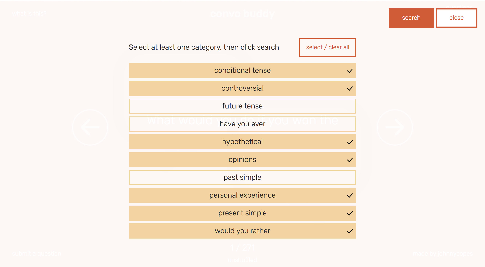

# Convo Buddy

######
[Live Project]()   |   [Overview](https://github.com/johnnycopes/convo-buddy/#overview)   |   [What I Used](https://github.com/johnnycopes/convo-buddy#what-i-used)   |   [MVP](https://github.com/johnnycopes/convo-buddy#mvp-minimum-viable-product)   |   [Challenges](https://github.com/johnnycopes/convo-buddy#challenges--solutions)   |   [Code](https://github.com/johnnycopes/convo-buddy#code-snippets)   | [Screenshots](https://github.com/johnnycopes/convo-buddy#screenshots)   |

## Overview:
Convo Buddy is a free tool that helps ESL teachers get the conversation started. Features more than 300 hand-picked questions intended to help English language learners practice speaking. Questions can be generated one at a time or viewed all at once.

##What we used:
**Languages:**  
* HTML5
* CSS/SCSS
* JavaScript (Node.js)

**Frameworks:**  
* Angular
* Express

**Other:**  
* MongoDB
* Apache
* Amazon Web Services EC2
* Icons from The Noun Project
  * *SPEECH BUBBLES made by bmijnlieff -- info@bmijnlieff.nl*
  * *CHECKMARK and ARROWS made by Sergey Shmidt -- http://shmidt.co/*


## MVP (Minimum Viable Product):
My priority was to create a tool that ESL teachers would genuinely find useful. Thus, my priority in this project was a straightforward, polished product that would work well across all modern devices and browsers.

**Initial MVP**
* Robust application that looks and functions consistently across all devices and browsers (tested for real-world use)
* Individual display of questions and ability to go back, advance, and shuffle the current collection
* View for all of the available questions, organized by category
* Ability for users to send in their own questions if they want to contribute

**Stretch Goals**
* Ability for users to create an account, log in, and modify questions and categories however they pleased. Changes would be visible while they were logged in and revert to the standard after logging out
* Even tighter animations and even heavier testing to ensure perfect view and functionality across all devices

## Challenges & Solutions:
Below are some of the most notable challenges I came across while making this project:

1.  **Challenge:**
    Creating a database schema that would keep not only the questions and categories organized, but also allow for the stretch goal of user modification later down the line if time allowed.

    **Solution:**
    In the schema, both the categories and the questions include 'userId' and 'parentId' fields. The idea is that if a user were logged in and wanted to modify one, a copy would be created and linked to both the user and the original version. From that point forward, the user would see their modified version of that category or question instead of the original, and it could later be modified again or deleted. Essentially, the user would have a personalized overlay of questions and categories that would sit on top of the default selection.

2.  **Challenge:**

    **Solution:**

3.  **Challenge:**

    **Solution:**

4. **Challenge:**

    **Solution:**


## Code Snippets

(description):
```JavaScript
```

(description):
```JavaScript
```

(description):
``` JavaScript
```

## Screenshots





********

#Contribute to Convo Buddy

##Desired Contributions:
First and foremost are additional questions that would be useful in the classroom! GitHub developers, I know that some of you have come to this wonderful field from other careers; if there are any former (or current) ESL teachers who know some questions that will spark a lively debate, I encourage you to submit them! Otherwise, it would be fantastic to get started on the aforementioned stretch goals:

* User upload of product images
* Advanced text-editor for new reviews
* Community evaluation of a review through a voting system
* Assigning a reputation to a reviewer based on the scores of their posted reviews
* Nerd-tastic improvements to our UI

##Contributing
1. Fork it
2. Create a new feature branch (named after your intended feature): `git checkout -b new-feature-name`
3. Commit your changes: `git commit -am 'Added the feature!'`
4. Push to your feature branch: `git push origin new-feature-name`
5. Submit a pull request!

##Project History
01/05/2017 - Project Completion and Deployment  
12/19/2016 - Project Start
